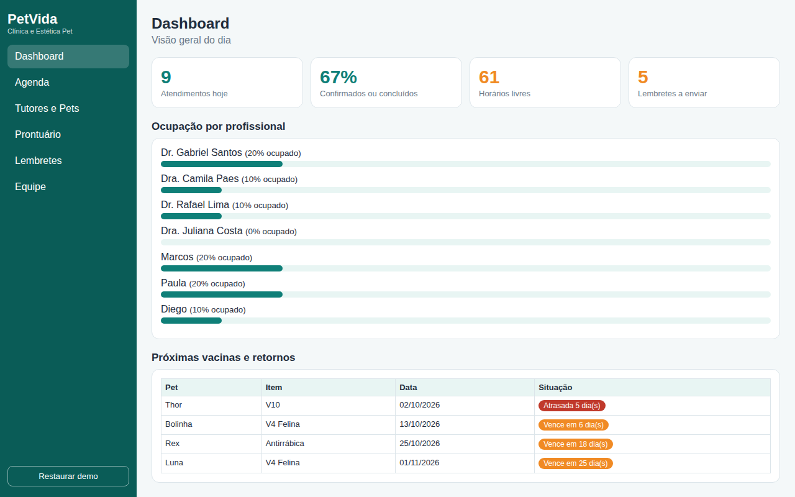
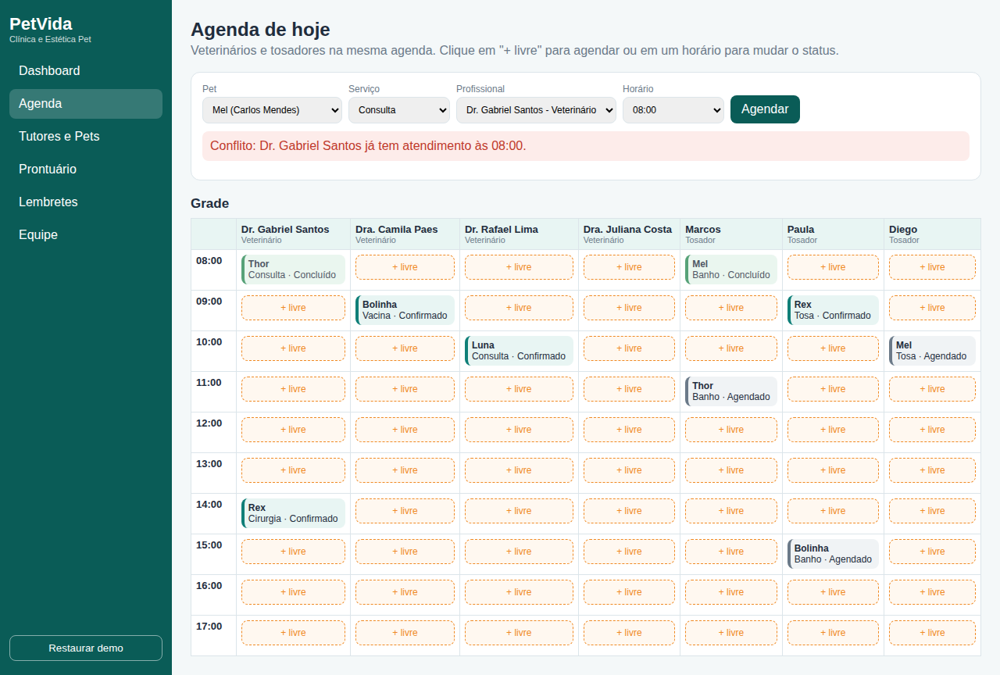
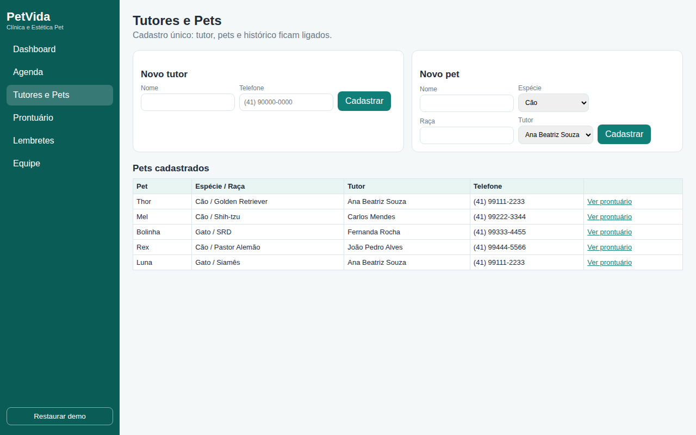
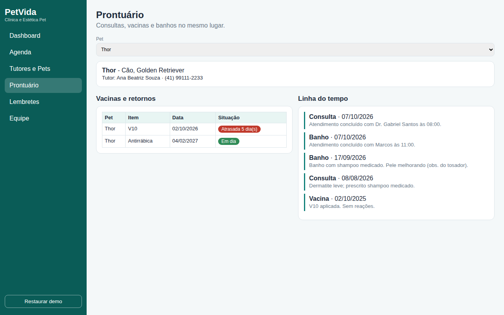
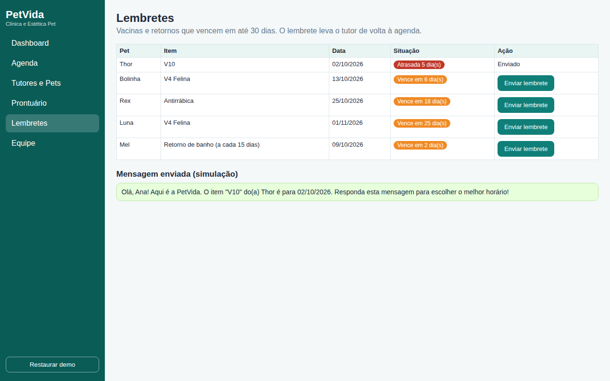
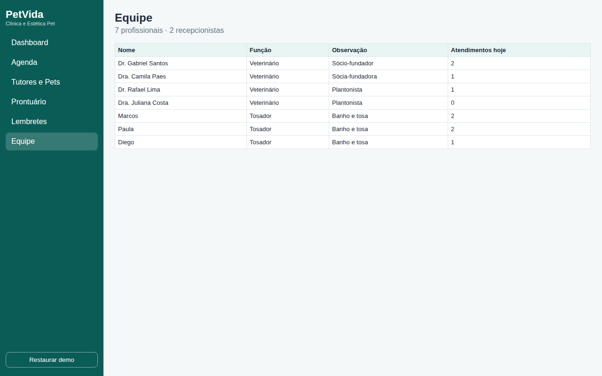
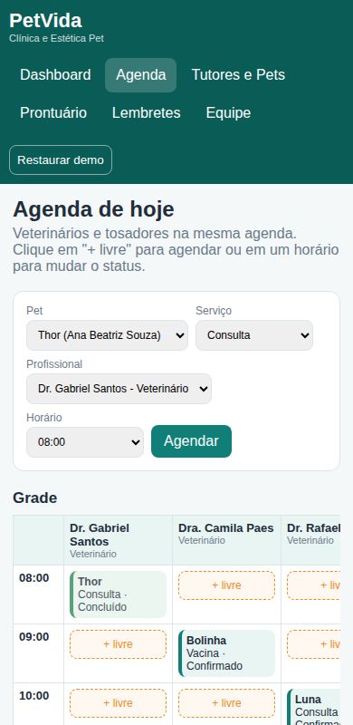

# PetVida Clínica - Sistema de Agendamento e Prontuário

Trabalho da disciplina **Design Profissional - Produção de Portfólio & Desenvolvimento Empresarial** (Estudo de Caso 5, Prof. Sedenilso Antonio Machado).

**Demonstração online:** _colocar aqui o link do GitHub Pages_

## 1. A empresa
A PetVida é uma clínica veterinária e centro de estética pet de bairro, fundada pelo Dr. Gabriel Santos e pela Dra. Camila Paes. Oferece consultas, vacinação, cirurgias de pequeno porte e banho e tosa. A equipe tem os 2 sócios, 2 veterinários plantonistas, 3 tosadores e 2 recepcionistas.

## 2. Problema (briefing)
Todo o agendamento é feito em uma agenda de papel na recepção. Com mais de 30 banhos por dia e consultas sobrepostas, aparecem estes problemas:

| Problema | Consequência |
|---|---|
| Choque de horários | Atrasos e tutores insatisfeitos |
| Tutores esquecem o banho ou a vacina | Horários vazios na agenda |
| Histórico médico em pastas de papel | A recepção perde tempo procurando fichas |
| Sem lembretes de retorno | Perda de receita e caixa imprevisível |

A oportunidade é juntar o cuidado estético com o histórico de saúde do animal, o que é um diferencial em relação aos pet shops de rede.

## 3. Solução escolhida e justificativa
Escolhi fazer um **sistema (dashboard) web** de uso interno da clínica.

- **Por que não um app de celular?** O problema está dentro da clínica (recepção, veterinários e tosadores). Um app precisaria ser instalado pelos tutores e publicado nas lojas, o que não cabe no prazo.
- **Por que não um site institucional?** Um site divulga a clínica, mas não resolve choque de horário nem o histórico dos pets.
- **Por que um sistema web?** Funciona em qualquer navegador, sem instalar nada, e a recepção, os veterinários e os tosadores usam a mesma tela. O contato com o tutor é feito pelos lembretes (simulados como mensagem de WhatsApp).

## 4. Funcionalidades e o problema que cada uma resolve
| Funcionalidade | Problema resolvido |
|---|---|
| Agenda única de veterinários e tosadores, com bloqueio de conflito | Choque de horários |
| Botão "+ livre" nos horários vagos | Horários vazios |
| Lembretes de vacinas e retornos, com mensagem pronta | Esquecimento dos tutores |
| Prontuário com consultas, vacinas e banhos | Histórico demorado de achar |
| Atendimento concluído vai sozinho para o prontuário | Junta estética e saúde |
| Cadastro de tutores e pets | Dados organizados |
| Dashboard com ocupação, confirmações e lacunas | Previsibilidade para a clínica |
| Status do atendimento (Agendado, Confirmado, Concluído) | Controle da agenda |

Regra extra: consulta, vacina e cirurgia só podem ser marcadas com veterinários, e banho e tosa só com tosadores.

## 5. Tecnologias
HTML, CSS e JavaScript puro. Os dados são fictícios (arquivo `js/data.js`) e ficam salvos no `localStorage` do navegador. Não tem backend, banco de dados nem bibliotecas externas.

## 6. Arquitetura e pastas
O sistema é uma página só. O `data.js` tem os dados, o `app.js` desenha cada tela e controla os formulários e botões, e a navegação usa o `#` da URL.

```
petvida-clinica/
├── index.html      # estrutura da página e menu
├── css/style.css   # visual
├── js/data.js      # dados de demonstração
├── js/app.js       # telas e regras do sistema
├── docs/           # prints das telas
├── .gitignore
├── LICENSE
└── README.md
```

## 7. Telas

**Dashboard**


**Agenda** (a imagem mostra o aviso de conflito de horário)


**Tutores e Pets**


**Prontuário**


**Lembretes**


**Equipe**


**Agenda no celular**



## 8. Como executar
Não precisa instalar nada. Escolha uma opção:

1. Baixe ou clone o repositório e abra o arquivo `index.html` no navegador.
2. Ou rode `python -m http.server 8000` na pasta e abra `http://localhost:8000`.
3. Ou publique no GitHub Pages: Settings > Pages > Deploy from a branch > branch `main` e pasta `/ (root)`.

O botão **Restaurar demo** (menu lateral) volta os dados para o início.

## 9. Segurança
O projeto não tem nenhuma senha, token ou chave de API, nem no código nem no histórico de commits. Todos os dados são fictícios. O texto digitado nos formulários é tratado antes de aparecer na tela, para não virar HTML. Em um sistema real seriam necessários login, backend e banco de dados com controle de acesso.

## 10. Licença
Código sob a licença [MIT](LICENSE).
